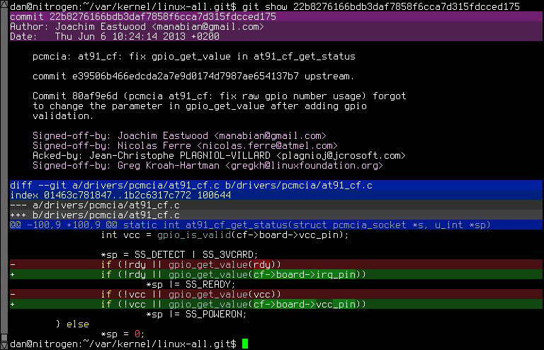

## Fancydiff

[](https://travis-ci.org/da-x/fancydiff)

Fancydiff is a diff coloring wrapper for Git that supports both intra-line diffs, and source code syntax highlighting.



This similar to what you see on Github, but instead it is done in the user's console.

## Dependencies

This can be built with the Haskell community's 'stack' tool.

## Git configuration

With `fancydiff` in `$PATH` the following configuration can be used in `.gitconfig`. It can be a drop-in
replacement for `diff-highlight` and `git`'s own diff coloring, via:

```
[color]
    diff = off
[pager]
    log = fancydiff | LESSANSIENDCHARS=mK less
    show = fancydiff | LESSANSIENDCHARS=mK less
    diff = fancydiff | LESSANSIENDCHARS=mK less
```

Optionally, it may be used via aliases:

```
[alias]
    log-fancy = "!git -c color.diff=off -c pager.log='fancydiff | LESSANSIENDCHARS=mK less' log $@ || true"
    show-fancy = "!git -c color.diff=off -c pager.show='fancydiff | LESSANSIENDCHARS=mK less' show $@ || true"
    diff-fancy = "!git -c color.diff=off -c pager.diff='fancydiff | LESSANSIENDCHARS=mK less' diff $@ || true"
```

## Setup on MacOS X


### Dependencies

Download a **nightly** of [iTerm2](https://www.iterm2.com/downloads.html), which supports 24-Bit True Color
ANSI codes.

Download [haskell-stack](http://docs.haskellstack.org/en/stable/install_and_upgrade.html#mac-os-x) for MacOS X,
and do the following:

```
brew install icu4c
brew install openssl
```

### Build and install

Change to the cloned repo of Fancydiff and do the following:

```
stack setup
stack install \
    --extra-include-dirs=/usr/local/opt/icu4c/include   \
    --extra-lib-dirs=/usr/local/opt/icu4c/lib           \
    --extra-include-dirs=/usr/local/opt/openssl/include \
    --extra-lib-dirs=/usr/local/opt/openssl/lib
```

## Limitations

 * Too few source code languages are supported.
